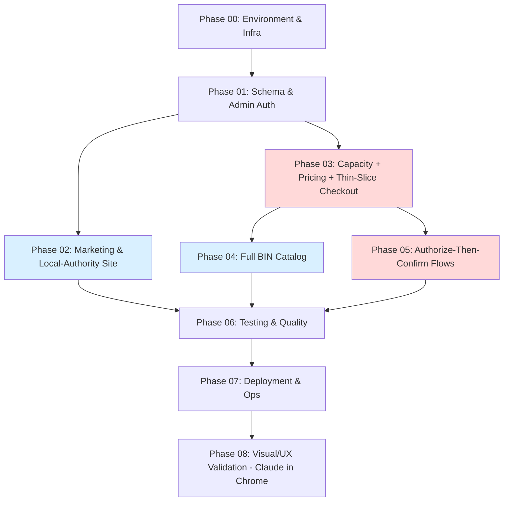

# BUILDPLAN: Hamptons Tree Experts Platform

**Spec Version:** v2 (LOCKED)
**SOW Reference:** hamptons-tree-experts-sow-v2.2.md
**Generated:** July 1, 2026
**Target Stack:** Next.js (App Router) + FastAPI + Supabase/PostgreSQL + Stripe, Docker on Hetzner VPS
**Deployment Target:** Single Hetzner VPS (5.161.88.134), Docker Compose + Nginx
**Operator:** Claude Code

---

## Build Sequence

**Legend:** Red = Very-High-complexity money core (all CRITICAL review findings live here — build with maximum care). Blue = parallel-capable.

**Parallelism:**
- **P02 ∥ P03** — once Phase 01 is done, the marketing site (P02) and the checkout engine (P03) share no code and can run in two terminals simultaneously. This directly serves the "launch leads ASAP" priority: P02 can go live for lead generation while P03 is still under construction.
- **P04 ∥ P05** — both depend on P03 but not each other; parallelizable once P03 promotes.

## Phase Summary

| Phase | Name | Complexity | Est. Turns | Prerequisites | SOW Features | Operator File | Status |
|-------|------|-----------|------------|---------------|-------------|---------------|--------|
| 00 | Environment & Infrastructure | Low | 25 | None | — | `phase-00-environment.md` | ⬜ |
| 01 | Schema & Admin Auth Foundation | Medium | 50 | 00 | — (data model for all) | `phase-01-foundation.md` | ⬜ |
| 02 | Marketing & Local-Authority Site | Medium | 50 | 01 | F-001, F-002, F-016, F-017, F-018 | `phase-02-marketing-site.md` | ⬜ |
| 03 | Capacity + Pricing + Thin-Slice Checkout | **Very High** | 100 | 01 | F-008, F-010, F-011, F-012, F-014, F-015 | `phase-03-capacity-checkout.md` | ⬜ |
| 04 | Full BIN Catalog | Medium | 50 | 03 | F-004, F-005, F-006, F-007 | `phase-04-bin-catalog.md` | ⬜ |
| 05 | Authorize-Then-Confirm Flows | **Very High** | 100 | 03 | F-003, F-009, F-013, F-019, F-020 | `phase-05-authorize-confirm.md` | ⬜ |
| 06 | Testing & Quality | High | 75 | 02, 04, 05 | (all — test coverage) | `phase-06-testing.md` | ⬜ |
| 07 | Deployment & Ops | Medium | 50 | 06 | (ops for all) | `phase-07-deployment.md` | ⬜ |
| 08 | Visual/UX Validation (Claude in Chrome) | Manual | — | 07 | (F-017 UX) | `phase-08-visual-validation.md` | ⬜ |

## Feature Traceability

Every SOW v2.2 feature appears in exactly one build phase.

| SOW Feature | Description | Build Phase | Spec Sections | Status |
|-------------|-------------|-------------|---------------|--------|
| F-001 | Core service + emergency pages | 02 | §4.1 | ⬜ |
| F-002 | Priority town landing pages | 02 | §2.2, §4.1 | ⬜ |
| F-003 | Plants authorize-confirm | 05 | §3.2, §5.1 | ⬜ |
| F-004 | BIN mulching | 04 | §3.2 | ⬜ |
| F-005 | BIN weed block fabric | 04 | §3.2 | ⬜ |
| F-006 | BIN topsoil + reseeding | 04 | §3.2 | ⬜ |
| F-007 | BIN bounded yard cleanup | 04 | §3.2, §8.1 | ⬜ |
| F-008 | BIN stump grinding | 03 | §3.2 | ⬜ |
| F-009 | Tree removal estimate tool | 05 | §3.2, §2.2 | ⬜ |
| F-010 | Urgency-tier pricing engine | 03 | §3.2, §4.2 | ⬜ |
| F-011 | Single shared-crew capacity | 03 | §2.2, §1.3 | ⬜ |
| F-012 | Immediate-capture checkout | 03 | §3.2, §5.1 | ⬜ |
| F-013 | Authorize/capture-on-confirm (Option B, 3 actions) | 05 | §3.2, §5.1 | ⬜ |
| F-014 | Guest checkout + lookup | 03 | §3.2, §7.2 | ⬜ |
| F-015 | Admin dashboard | 03 | §3.2, §4.1 | ⬜ |
| F-016 | Permit content hub | 02 | §2.2 | ⬜ |
| F-017 | Design system | 02 (tokens in 00) | §4.2, §4.3 | ⬜ |
| F-018 | SEO + analytics foundation | 02 | §1.2, §5.2 | ⬜ |
| F-019 | Photo storage | 05 | §2.2, §7.3 | ⬜ |
| F-020 | No-refund/reschedule policy | 05 | §3.2 | ⬜ |
| F-050–F-054 | Enhancements (SMS, auto-weather, bundles, accounts, blog) | Deferred (Phase 4/5 SOW, post-launch) | §6 | ⬜ |

---

## Phase Details

### Phase 00: Environment & Infrastructure
**Complexity:** Low | **Est. Turns:** 25 | **Prerequisites:** None
**Operator:** `phase-00-environment.md` | **Review:** `review-phase-00.md`
**Objective:** Scaffold repo, Docker Compose (web/api/nginx), env config, and — critically — the timezone and money-route-bypass configuration and design tokens the later phases depend on.
**Components:** directory structure (spec §4.1); Docker Compose; Nginx config with **money endpoints routed direct-to-FastAPI, uploads dir NOT served statically** (R-18, R-11); `TZ`/app timezone = `America/New_York` (R-08); `.env.example`; design-tokens file (F-017 palette/type from the approved direction).
**Acceptance:** `docker compose up` clean; app responds; DB connects; timezone verified `America/New_York`; Nginx does not statically serve `/var/hte/uploads`.
**Rollback:** delete project dir, re-scaffold. No state.

### Phase 01: Schema & Admin Auth Foundation
**Complexity:** Medium | **Est. Turns:** 50 | **Prerequisites:** 00
**Operator:** `phase-01-foundation.md` | **Review:** `review-phase-01.md`
**Objective:** Full schema + admin auth. After this, the data model supports every feature and the admin can log in.
**Components:** all tables (spec §2.2) incl. `processed_webhooks` (R-10), `outbox_emails` (R-08-email), `job_runs` (R-31); **`UNIQUE(day,slot)` invariant**; status state machine + transition function (R-21); all indexes incl. `customer_name`/`customer_phone` (R-22) and high-entropy `order_number` generation (R-12); seed data (§2.4); Supabase admin auth + **forced-password-change + MFA bootstrap** (R-13-adjacent); money = integer cents everywhere (§2.3).
**Acceptance:** all tables/columns/constraints/indexes match spec exactly; `UNIQUE(day,slot)` present; FK relationships match §2.1; status transition function rejects invalid transitions; admin can authenticate; seed loads clean.
**Review Checkpoint:** **CRITICAL — schema errors cascade.** Verify the capacity invariant, integer-cents money columns, the full status enum incl. `needs_reslot`, and `original_quote_cents` write-once.
**Rollback:** drop tables, re-migrate. Seed-only data impact.

### Phase 02: Marketing & Local-Authority Site (SOW Phase 1)
**Complexity:** Medium | **Est. Turns:** 50 | **Prerequisites:** 01 | **Parallel with:** 03
**Operator:** `phase-02-marketing-site.md` | **Review:** `review-phase-02.md`
**Objective:** The lead-generating public site — service/town/permit/emergency pages, design system, SEO+analytics, lead form with manual capacity-pause toggle.
**Components:** F-001 (service pages + emergency page), F-002 (town pages, testable local-content standard), F-016 (permit hub, **verified=true publish gate R-29**), F-017 (design system per `frontend-design` skill), F-018 (LocalBusiness/Service schema, GA4 + Google Ads events); manual lead form + pause toggle.
**Acceptance:** site indexed; schema validates in Rich Results Test; CWV pass mobile; **`generateStaticParams` filters `verified=true` — no unverified permit content published (R-29)**; **real photos present, no placeholders (R-33 hard gate)**; Manorville permit page withheld pending jurisdiction verification (N2).
**Rollback:** git revert to phase tag. No user data.

### Phase 03: Capacity + Pricing + Thin-Slice Checkout (SOW Phase 2a) — ⚠️ MONEY CORE
**Complexity:** Very High | **Est. Turns:** 100 | **Prerequisites:** 01 | **Parallel with:** 02
**Operator:** `phase-03-capacity-checkout.md` | **Review:** `review-phase-03.md`
**Objective:** The capacity + pricing + first paid-checkout slice. One real, paid, capacity-checked BIN order (stump grinding) end-to-end, with oversell structurally impossible.
**Components:** F-011 (2-slot shared pool; inline-expiry-on-conflict R-16; weather-block FOR UPDATE R-15; lazy-day upsert R-14; single-owner scheduler R-17); F-010 (pinned multipliers + round-half-up-once R-07, 4pm cutoff in America/New_York R-08); F-012 (**reserve-then-charge, NO Stripe-in-transaction R-01**); F-014 (guest checkout + uniform-404 lookup R-12/R-16); F-015 (dashboard, surfaces `needs_reslot`); F-008 (stump grinding as the thin-slice BIN item); mandatory idempotency keys (R-09).
**Acceptance:** one real paid capacity-checked order end-to-end; **concurrent-booking test: exactly one of two simultaneous bookings for the last slot wins, other gets 409 (proves O-004)**; 4pm cutoff correct in EST/DST; quote total === captured total (R-07); idempotent double-submit returns one order (R-09); Stripe call never inside a DB transaction (R-01).
**Review Checkpoint:** **HIGHEST-RISK PHASE.** Verify R-01 reserve-then-charge, the O-004 concurrency test, R-07 rounding, R-08 timezone, R-09 idempotency.
**Rollback:** git revert to phase tag; migrations reversible; no captured real orders in test.

### Phase 04: Full BIN Catalog (SOW Phase 2b)
**Complexity:** Medium | **Est. Turns:** 50 | **Prerequisites:** 03 | **Parallel with:** 05
**Operator:** `phase-04-bin-catalog.md` | **Review:** `review-phase-04.md`
**Objective:** Remaining bounded BIN services purchasable online.
**Components:** F-004 (mulch), F-005 (weed block), F-006 (topsoil+reseed), F-007 (yard cleanup with **5 cu yd / 1-acre bound → over-bound redirects to estimate flow**). Reuses the Phase 03 checkout/pricing/capacity engine.
**Acceptance:** all four services purchasable; over-bound yard cleanup redirects to estimate, never sells as BIN; each service's pricing model uses pinned multipliers.
**Rollback:** git revert to phase tag.

### Phase 05: Authorize-Then-Confirm Flows (SOW Phase 3) — ⚠️ MONEY CORE
**Complexity:** Very High | **Est. Turns:** 100 | **Prerequisites:** 03 | **Parallel with:** 04
**Operator:** `phase-05-authorize-confirm.md` | **Review:** `review-phase-05.md`
**Objective:** Tree-removal estimates and plant orders that authorize-then-capture, with the full Option B admin action set and all clock/state reconciliation.
**Components:** F-009 (estimate tool, deterministic wide range R-06, no urgency tier R-34); F-003 (plant authorize-confirm on its own fixed-price endpoint R-19); F-013 (**Option B: Capture / Cancel / Extend-via-link — no Increase/Decrease**; atomic slot re-assertion on capture R-03; scoped cancel R-26); F-019 (photo EXIF strip + auth'd serve endpoint + 90d purge R-11/R-20); F-020 (active acknowledgment R-13); clock reconciliation → `needs_reslot` (R-03); BIN-bumps-tentative money+state (R-04); webhook PI-correlation (R-05).
**Acceptance:** estimate places auth hold + tentative 48h soft-hold via reserve-then-charge; **oversell-via-money-path test: estimate → soft-hold expiry → slot rebooked → manager Capture REFUSED with 409 (R-03)**; reauth-void not misread as cancel (R-05); bump → `needs_reslot` + retained hold + concrete new slot (R-04); photos strip EXIF and serve only via auth'd endpoint (R-11); **F-020 disclosure has active ack AND passed legal review (R-13 blocking gate)**.
**Review Checkpoint:** **HIGHEST-RISK PHASE.** Verify R-01/R-03/R-04/R-05 and the Option B action set.
**Rollback:** git revert to phase tag; migrations reversible.

### Phase 06: Testing & Quality
**Complexity:** High | **Est. Turns:** 75 | **Prerequisites:** 02, 04, 05
**Operator:** `phase-06-testing.md` | **Review:** `review-phase-06.md`
**Objective:** Playwright E2E + unit/integration coverage per spec §9, prioritizing the money core.
**Components:** Playwright (Chromium primary + Firefox/WebKit; 375/768/1440 viewports); the MUST-pass E2E journeys from §9.3 including **oversell-via-money-path (R-03), concurrent-oversell (O-004), idempotent double-submit (R-09), reauth-void-not-cancel (R-05)**; unit tests for pricing/rounding (R-07), state machine (R-21), soft-hold expiry, timezone cutoff (R-08); seed scripts (§9.5).
**Acceptance:** all MUST journeys pass across browsers/viewports; unit coverage meets §9.2 targets; no shared mutable test state.
**Rollback:** tests are additive; no rollback needed.

### Phase 07: Deployment & Ops
**Complexity:** Medium | **Est. Turns:** 50 | **Prerequisites:** 06
**Operator:** `phase-07-deployment.md` | **Review:** `review-phase-07.md`
**Objective:** Production config, monitoring, backup coordination, health.
**Components:** production Docker/Nginx/TLS; `/health` reporting DB + job freshness (R-31); scheduler single-owner enforcement (R-17); **coordinated DB + photo-volume backups + one documented restore-and-verify test before photos go live (R-32)**; smoke tests.
**Acceptance:** production deploy succeeds; `/health` green incl. job status; restore-and-verify test documented and passed; rollback procedure documented.
**Rollback:** revert to previous Docker image.

### Phase 08: Visual/UX Validation (Claude in Chrome) — Human-Triggered
**Complexity:** Manual | **Prerequisites:** 07
**Operator:** `phase-08-visual-validation.md` (instructs the human, not Claude Code)
**Objective:** Human uses Claude in Chrome to validate the deployed UI — the signature urgency-tier selector, mobile checkout (storm-urgent persona), empty/error/loading states, accessibility/contrast (F-017) — at 375/768/1440.
**Acceptance:** key journeys from §9.3 validated visually at each breakpoint; findings triaged.

---

## Execution Guidance — Claude Code Orchestration

**Per-phase workflow:** paste the phase file into a fresh Claude Code session → run `claude --max-turns [N]` → `--continue` if it hits the limit (progress carried by `PHASE-NN-PROGRESS.md`) → on completion, paste the matching review prompt into a **separate** session → act on PROMOTE / FIX / ESCALATE.

**Session isolation:** fresh session per phase. Never continue one phase's session into the next — the completion report carries context forward, not the session.

**Parallel execution:** after Phase 01 promotes, run P02 and P03 in two terminals. After P03 promotes, run P04 and P05 in two terminals. No shared files across these pairs.

**Human decision gates (non-negotiable):**
1. After Phase 00 — verify structure before building on it.
2. After Phase 01 — **schema review is critical**; errors cascade.
3. After Phase 03 — **money core**; verify O-004 concurrency + R-01 before building more on it.
4. After Phase 05 — **money core**; verify the authorize-confirm state machine.
5. Before Phase 07 deploy — final production sign-off.
6. Any ESCALATE verdict.

---

## Risk Register (carried from the adversarial review)

| Risk | Phase | Mitigation in Build Plan |
|------|-------|--------------------------|
| Charge-without-record (Stripe-in-transaction, R-01) | 03, 05 | Reserve-then-charge is an explicit acceptance criterion + E2E test; danger-zone warning in both operator prompts |
| Oversell via money path (clock mismatch, R-03) | 05 | Dedicated oversell-via-money-path E2E test must pass before promote |
| Oversell via booking path (O-004) | 03 | `UNIQUE(day,slot)` + concurrent-booking E2E test |
| Off-session re-auth impossible (R-02) | 05 | Option B (3 actions) baked into F-013 spec + operator prompt |
| Unverified permit content published (R-29) | 02 | `verified=true` filter in `generateStaticParams` is an acceptance criterion |
| F-020 chargeback/consumer-protection exposure (R-13) | 05 | Active acknowledgment + **legal review is a blocking gate** before Phase 05 ships |
| Photo PII / RCE via static serve (R-11) | 05 | EXIF strip + auth'd-only serve endpoint; Nginx static-serve of uploads blocked in Phase 00 |
| Timezone bug in cutoff/slots (R-08) | 03 | America/New_York pinned in Phase 00; DST unit tests in Phase 06 |
| Scheduler double-fire (R-17) | 03, 07 | Advisory-lock wrap; single-owner enforced in deployment |

## Rollback Strategy

| Phase | Rollback Approach | Data Impact |
|-------|------------------|-------------|
| 00 | Delete project, re-scaffold | None |
| 01 | Drop tables, re-migrate | Seed only |
| 02 | Git revert to phase tag | None (static content) |
| 03–05 | Git revert to phase tag; migrations reversible | Preserve any real orders; test orders disposable |
| 06 | N/A (additive tests) | None |
| 07 | Revert to previous Docker image | Zero downtime if image-swapped |
