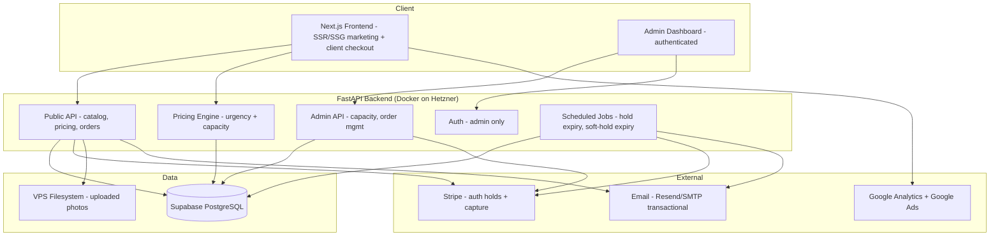
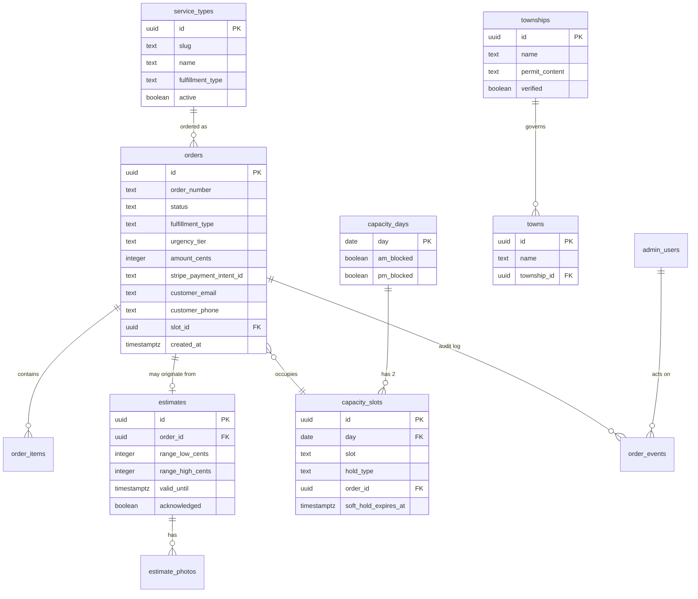

# Master Architecture Specification: Hamptons Tree Experts Platform
**Version:** 2
**SOW Reference:** hamptons-tree-experts-sow-v2.2.md
**Date:** July 1, 2026
**Status:** LOCKED (locked July 1, 2026 by Adam Larkin — post-adversarial-review; incorporates all 34 consolidated panel findings across Grok / Gemini / Claude Opus 4.8. Owner elected to lock without a second review cycle.)

---

## 0. Review Changelog (v1 → v2)

v1 came back **NOT READY** from all three review models, which converged on a cluster of money/state-machine defects. This version applies all 34 findings (R-01…R-34). The load-bearing changes:

- **R-01 (CRITICAL, 3/3 consensus):** BIN checkout no longer wraps the Stripe call in a DB transaction. Replaced with **reserve-then-charge + compensating release**, reconciled via webhook. See §3.2, §5.1.
- **R-02 (CRITICAL) → Option B:** Payment re-auth collapsed to **Capture / Cancel / Extend-via-link** — no Increase/Decrease, since off-session re-auth needs a stored method this project doesn't use. See §3.2 admin action, SOW v2.2 F-013.
- **R-03 (CRITICAL):** The 48h soft-hold clock and the ~7-day Stripe auth clock are now **reconciled** — capture re-asserts the slot atomically; soft-hold expiry on an authorized order routes to a `needs_reslot` state instead of silently releasing. See §2.2 status enum, §3.2 capture.
- **R-04 (CRITICAL):** BIN-bumps-tentative now has a **fully defined money+state transition** (`needs_reslot`, hold retained, customer offered a concrete new slot). See §3.2.
- **R-05 (HIGH):** Webhook correlates by **active PaymentIntent id + target state**, not just event id, so a re-auth void can't be misread as a cancel. See §3.3.
- Plus: pinned timezone (R-08), pinned multipliers + rounding (R-07), estimate range algorithm (R-06), mandatory idempotency (R-09/R-10), photo EXIF/serving hardening (R-11), high-entropy order numbers + uniform 404 (R-12), active F-020 acknowledgment (R-13), and the schema/ops/UX items R-14…R-34. Each is annotated inline with its R-ID.

---

## 1. System Architecture Overview

### 1.1 Architecture Diagram



### 1.2 Technology Stack

| Layer | Technology | Version | Rationale |
|-------|-----------|---------|-----------|
| Frontend | Next.js (App Router) | 14+ | Matches existing Benchworks stack; SSG for marketing/SEO pages (F-001/F-002/F-016), client components for checkout |
| Backend | FastAPI (Python) | 0.11x | Matches existing stack; pricing/capacity logic lives here as the single source of truth, never client-side |
| Database | Supabase (PostgreSQL) | 15+ | Matches existing stack; Postgres constraints enforce the capacity invariant that protects O-004 |
| Auth | Supabase Auth (admin only) | current | Guest checkout means no customer auth (F-014); only the admin/dispatcher logs in |
| Payments | Stripe | API 2024+ | Confirmed decision: standard auth holds (not SetupIntent), manual capture |
| File storage | Hetzner VPS filesystem | - | Confirmed decision (F-019): no S3; photos are low-sensitivity, stored server-side with 90-day retention |
| Hosting | Hetzner VPS + Docker + Nginx | - | Existing infra (5.161.88.134); Nginx reverse proxy, Docker Compose orchestration |
| Analytics | GA4 + Google Ads | - | F-018; conversion events on lead form, BIN checkout, estimate submission |
| Email | Resend or VPS SMTP | - | Transactional only (order confirmations, reschedule notices, manager reminders); no bulk/marketing at launch |

**Explicitly not in the stack (per SOW):** Redis (no caching layer needed at launch scale — one crew, low order volume); Twilio/SMS (deferred to Phase 5, F-050); S3/object storage (F-019); any Carlos-system integration; Stripe SetupIntent / stored payment methods (Option B — no off-session re-auth).

**Business timezone (R-08):** `America/New_York` is the single canonical business timezone. All date-sensitive logic — the `capacity_days.day` date key, "today"/"tomorrow" resolution, the F-010 4:00 PM Tomorrow cutoff, and soft-hold/auth-hold expiry math — is computed in `America/New_York`. Timestamps are stored as `timestamptz` in UTC and converted at the boundary. This is not left to the container's default (UTC), which would shift the 4pm cutoff to ~11am–1pm local depending on DST and mis-key slots near local midnight. Unit tests cover the cutoff at DST transitions and near local midnight.

**Money endpoint routing (R-18):** The Stripe webhook and all money endpoints (`/orders/bin`, `/estimates`, `/admin/orders/*`) route **directly to FastAPI**, bypassing any Next.js `api/` proxy, so the exact raw request body reaches Stripe signature verification untouched and so rate-limit/enumeration defenses key off the true client IP (Nginx `real_ip` trusting `X-Forwarded-For` only from the known proxy hop).

### 1.3 Deployment Topology

Single Hetzner VPS running Docker Compose with three services: `web` (Next.js, behind Nginx), `api` (FastAPI + a lightweight scheduler for background jobs), and Nginx as reverse proxy terminating TLS. Supabase is the managed Postgres instance (existing project, new schema/tables namespaced to this app). Uploaded photos persist to a Docker volume mounted from the VPS filesystem (`/var/hte/uploads`), backed up in the existing VPS backup routine. Environment config via `.env` (never committed); secrets = Stripe keys, Supabase service key, email credentials, admin bootstrap. SSH access via existing `hampton-vps` alias. Deployment is git-pull + `docker compose up --build` (no CI/CD pipeline required at launch, though a GitHub Actions build check is recommended in Phase 4).

Background jobs run as a scheduled task inside the `api` container (APScheduler or equivalent) — no separate worker service at this scale. Recurring jobs:
- **soft-hold expiry** (every 15 min): expires tentative capacity holds past 48h (F-011). For a tentative hold on an order still in `authorized`, it does NOT silently release the slot into the pool — it transitions the order to `needs_reslot` and surfaces it on the dashboard (R-03), because the Stripe hold is still live for ~5 more days.
- **auth-hold reminder** (hourly): flags orders whose Stripe auth reaches **day 3** for manager action (F-013, R-03/N3 — day 3 not day 5, since debit/some networks release faster than ~7 days).
- **photo purge** (daily, R-20): deletes `estimate_photos` rows and their files past `purge_after` (90 days, F-019); logs purged count.
- **outbox dispatch** (every minute, R-08-email/R-consensus): drains the DB-backed `outbox_emails` table (see §5.3) — email is not queued in-memory.

**Single-owner scheduling (R-17):** the in-process scheduler double-fires if the `api` service ever runs with `--workers N` or scales to >1 replica. Every job body is wrapped in a Postgres advisory lock (`pg_try_advisory_lock`) so only one instance runs a given tick, regardless of worker/replica count. The deployment documents that the `api` service runs a single scheduler owner.

**Job health (R-31):** a `job_runs` table records `job_name`, `last_success_at`. `/health` reports DB connectivity **and** whether each job's `last_success_at` is within its expected interval, so a silently-dead scheduler is detectable by the external uptime monitor.

**Backup coordination (R-32):** managed Supabase Postgres and the VPS photo volume are snapshotted on the same cadence. Because photos are pricing aids purged at 90 days, a small restore-window mismatch is tolerable — the admin photo endpoint degrades gracefully (missing file → "photo unavailable", not a 500). One documented restore-and-verify test runs before Phase 3 (when photos go live).

## 2. Database Schema

### 2.1 Entity Relationship Diagram



### 2.2 Table Definitions

#### `service_types`
**Implements:** F-001, F-003–F-009

| Column | Type | Constraints | Default | Description |
|--------|------|-------------|---------|-------------|
| id | uuid | PK | gen_random_uuid() | Primary key |
| slug | text | UNIQUE NOT NULL | | URL slug (e.g., `stump-grinding`) |
| name | text | NOT NULL | | Display name |
| fulfillment_type | text | NOT NULL CHECK (in 'bin_immediate','authorize_confirm','estimate') | | Drives which checkout path applies |
| pricing_model | jsonb | NOT NULL | | Base rates, tier definitions, bounds (e.g., yard cleanup 5 cu yd cap) |
| active | boolean | NOT NULL | true | Whether purchasable |
| created_at | timestamptz | NOT NULL | now() | |

**Seed:** mulch/weed-block/topsoil/yard-cleanup/stump-grinding = `bin_immediate`; plants = `authorize_confirm`; tree-removal = `estimate`.

#### `orders`
**Implements:** F-003–F-014, F-020

| Column | Type | Constraints | Default | Description |
|--------|------|-------------|---------|-------------|
| id | uuid | PK | gen_random_uuid() | |
| order_number | text | UNIQUE NOT NULL | | **High-entropy** human-facing lookup ID (R-12): 4-char service prefix + 10 random base32 chars (e.g., `HTE-7K2P9QX4MB`). Not sequential — sequential IDs give an enumeration attacker half the lookup payload for free. |
| service_type_id | uuid | FK → service_types NOT NULL | | |
| fulfillment_type | text | NOT NULL | | Denormalized from service_type at order time |
| status | text | NOT NULL CHECK | 'pending_payment' | See status state machine below |
| urgency_tier | text | CHECK (in 'tomorrow','2_5_day','6_14_day') NULL for estimate-type (R-34) | | Selected tier (F-010); NULL when the service is fulfillment_type 'estimate' unless tiers explicitly apply |
| amount_cents | integer | NOT NULL CHECK (>= 0) | | Currently-authorized/captured amount, integer cents (never float) |
| original_quote_cents | integer | NOT NULL CHECK (>= 0) | | Written once at creation, **never updated** (R-23) — preserves quote-vs-final history for analytics and dispute defense even if amount_cents changes |
| policy_acknowledged | boolean | NOT NULL | false | R-13 — set true only when the customer actively checks the F-020 no-refund disclosure at checkout; orders cannot reach `captured`/`authorized` with this false |
| stripe_payment_intent_id | text | | | The **currently active** PaymentIntent (R-05) — updated on Extend; the webhook ignores canceled events for any PI id that is not the current active one |
| stripe_auth_expires_at | timestamptz | | | For the day-3 reminder job (F-013) |
| customer_email | text | NOT NULL | | |
| customer_phone | text | NOT NULL | | Required for manual recovery (F-014) |
| customer_name | text | NOT NULL | | |
| service_address | text | NOT NULL | | Job location |
| slot_id | uuid | FK → capacity_slots | | Assigned slot; null for unslotted / needs_reslot orders |
| created_at | timestamptz | NOT NULL | now() | |
| updated_at | timestamptz | NOT NULL | now() | |

**Status state machine (R-21, R-03, R-04):** implemented as an explicit enum + a transition function with unit tests; invalid transitions raise.
- `pending_payment` — order + slot reserved, Stripe call not yet confirmed (R-01 reserve-then-charge intermediate state)
- `authorized` — Stripe auth hold live, awaiting crew confirmation (estimate/plants)
- `captured` — paid
- `confirmed_scheduled` — slot locked, job on the books
- `needs_reslot` — **(new, R-03/R-04)** order has a live Stripe hold but no valid slot (soft-hold expired while authorized, or bumped by a BIN order); must be surfaced on the dashboard for manual reslot or cancel — never silently dropped
- `rescheduled` — F-020 no-charge move to a new slot
- `cancelled` — hold voided / order stopped
- `completed` — job done
- `expired` — auth lapsed with no manager action; slot released
Valid transitions are documented in a state table in code; e.g. `authorized → needs_reslot → (confirmed_scheduled | cancelled)`, and `capture` is only permitted from `authorized`/`confirmed_scheduled` after an atomic slot re-assertion (R-03).

**Indexes:**
- `idx_orders_order_number` on `order_number` — F-014 lookup
- `idx_orders_status` on `status` — dashboard filtering (F-015)
- `idx_orders_auth_expires` on `stripe_auth_expires_at WHERE status='authorized'` — partial index for the reminder job (F-013)
- `idx_orders_customer_phone` on `customer_phone` and `idx_orders_customer_name` on `customer_name` (R-22) — the F-014 manual phone-recovery flow requires the admin to find orders by customer detail; without these it's a full table scan

#### `capacity_days` + `capacity_slots`
**Implements:** F-011 (the O-004 invariant)

`capacity_days`: one row per calendar day, holds `am_blocked`/`pm_blocked` booleans for the manual weather-pause control.

`capacity_slots`:

| Column | Type | Constraints | Default | Description |
|--------|------|-------------|---------|-------------|
| id | uuid | PK | gen_random_uuid() | |
| day | date | FK → capacity_days NOT NULL | | |
| slot | text | NOT NULL CHECK (in 'am','pm') | | |
| hold_type | text | NOT NULL CHECK (in 'confirmed','tentative') | | |
| order_id | uuid | FK → orders UNIQUE | | The order occupying this slot |
| soft_hold_expires_at | timestamptz | | | Set only for tentative holds (48h — F-011) |
| created_at | timestamptz | NOT NULL | now() | |

**Critical constraint (enforces O-004):** `UNIQUE (day, slot)` — the database itself makes it impossible for two orders to occupy the same day+slot, regardless of service type. This is the structural guarantee that a per-service-type bug can't reintroduce. There are exactly 2 slot rows possible per day (am, pm), shared across all services.

**Lazy day materialization (R-14):** because `capacity_slots.day` is an FK to `capacity_days`, and the weather-block path must block future days nobody has booked yet, both the booking path and the block path **upsert the `capacity_days` row first** — `INSERT INTO capacity_days(day) ... ON CONFLICT (day) DO NOTHING` — inside the same transaction as the slot insert / block update. This prevents an FK violation on the first booking or first block of any date.

**Inline expiry to avoid false 409s (R-16):** a tentative hold that has passed `soft_hold_expires_at` but hasn't yet been swept by the 15-min job must not reject a valid BIN sale. The slot-insert path uses `INSERT ... ON CONFLICT (day, slot) DO UPDATE SET ... WHERE capacity_slots.soft_hold_expires_at < now()` so an expired tentative row is transparently reclaimed at booking time; only a live confirmed/tentative row yields a genuine `409 SLOT_TAKEN`.

**Weather-block enforcement in the DB layer (R-15):** the oversell guarantee is structural, but the weather block was app-only. The slot-insert transaction now does a `SELECT ... FOR UPDATE` on the `capacity_days` row and rejects the insert if the relevant half (`am_blocked`/`pm_blocked`) is set — in the same transaction as the slot insert — so a concurrent booking cannot slip into a just-blocked half during a storm surge.

**Indexes:**
- `UNIQUE (day, slot)` — the oversell prevention invariant
- `idx_slots_soft_expiry` on `soft_hold_expires_at WHERE hold_type='tentative'` — partial index for the soft-hold expiry job

#### `estimates` + `estimate_photos`
**Implements:** F-009, F-019

`estimates`: `id`, `order_id` FK, `range_low_cents`, `range_high_cents`, `valid_until` (48h from creation), `acknowledged` boolean (the non-binding checkbox), self-report fields (`approx_height_stories int`, `distance_to_structure_ft int`, `access_notes text`), `created_at`.

`estimate_photos`: `id`, `estimate_id` FK, `file_path text` (VPS path under `/var/hte/uploads`), `purge_after date` (created_at + 90d — F-019), `created_at`.

#### `townships` + `towns`
**Implements:** F-002, F-016

`townships`: `id`, `name`, `permit_content text`, `verified boolean` (false until human-sourced/fact-checked — gates publish per F-016), `jurisdiction_note text` (for the Manorville caveat). Seed: Southampton, Riverhead, Brookhaven (**East Hampton dropped** per N1).

`towns`: `id`, `name`, `township_id` FK, `slug`. Seed maps Westhampton/Speonk/Remsenburg/Quogue → Southampton; Riverhead → Riverhead; Manorville → Brookhaven (`verified=false`, jurisdiction_note flags mixed status per N2).

#### `order_events`
**Implements:** audit trail for F-013 admin actions, F-020 reschedules

`id`, `order_id` FK, `admin_user_id` FK (nullable for system events), `event_type` (`authorized`,`captured`,`cancelled`,`reauthorized_increase`,`reauthorized_decrease`,`reauthorized_same`,`rescheduled`,`soft_hold_expired`,`bumped_by_bin`), `detail jsonb`, `created_at`. Append-only.

#### `processed_webhooks` (R-10)
**Implements:** §3.3 idempotency

`event_id text PK`, `created_at timestamptz`. The webhook checks-and-inserts this before processing so redelivery is a no-op. §3.3 claimed dedup-on-event-id but v1 defined no table to store the ids — this closes that gap.

#### `outbox_emails` (R-08-email / review consensus)
**Implements:** F-013, F-020, bump notices — reliably

`id`, `to_email`, `template`, `payload jsonb`, `status` (`pending`/`sent`/`failed`), `attempts int`, `last_error text`, `created_at`, `sent_at`. v1 said email was "queued with retry" but the stack has no Redis/queue — an in-memory queue loses messages on container restart. This DB-backed outbox is drained by the per-minute outbox-dispatch job (§1.3); email failures never block order state changes and survive restarts.

#### `admin_users`
**Implements:** F-015 (dashboard auth)

Managed by Supabase Auth; a thin profile table linking auth uid → role. Single admin at launch. **Bootstrap (R-13-adjacent/R-Grok-13):** created via the Supabase admin API with a forced password change on first login; MFA enabled on the account.

**Township publish gate (R-29):** the Next.js `generateStaticParams` for `permits/[township]` and `areas/[town]` MUST filter `WHERE verified = true`. Unverified township content (e.g., Manorville/Brookhaven pending jurisdiction confirmation, per SOW N2) is never statically generated or published — the accuracy gate is enforced at build time, not by good intentions.

### 2.3 Migrations Strategy

Supabase migrations (timestamped SQL files under `supabase/migrations/`). Forward-only in production; each migration has a tested rollback documented in a comment. The `UNIQUE (day, slot)` constraint and status CHECK constraints ship in the first migration and are never loosened without a review cycle. Money columns are `integer` cents everywhere — no `float`/`numeric` for currency, no exceptions.

### 2.4 Seed Data

Service types (8) with pricing models; townships (3, all `verified=false` until content is sourced); towns (6) mapped to townships; one bootstrap admin user (created via a one-off script reading credentials from env, not committed). Capacity days are created lazily (a day row is inserted the first time a slot is booked or blocked for that date).

## 3. API Design

### 3.1 API Conventions

- Base URL: `/api/v1`
- Auth: public endpoints unauthenticated (guest checkout); admin endpoints require Supabase JWT bearer token
- Content-Type: `application/json` (except photo upload: `multipart/form-data`)
- Error format: `{ "error": { "code": "string", "message": "string", "details": {} } }`
- Money: all amounts are integer cents in requests and responses
- Rate limiting: Nginx-level per-IP limits on public endpoints (esp. estimate submission + checkout — 10/min/IP); stricter on order-lookup (5/min/IP) to prevent order-number enumeration
- Idempotency (R-09): `POST /orders/bin` and `POST /estimates` **require** an `Idempotency-Key` header (not optional). It is passed through to Stripe AND used to dedupe order creation server-side, so a mobile double-tap or network retry returns the original order rather than creating a second order with a second auth hold that consumes a second slot. Clients also apply a submit-lock on the checkout/estimate forms as defense in depth.

### 3.2 Endpoint Definitions

#### Catalog & Pricing — Implements F-004–F-010

##### `GET /api/v1/services`
Public. Returns active service types with their fulfillment_type and pricing model shape (enough for the frontend to render the right configurator).

##### `POST /api/v1/pricing/quote`
**Purpose:** Server-side price calculation — the single source of truth. Never trust a client-computed price.
**Auth:** Public.
**Request:**
```json
{
  "service_slug": "stump-grinding",
  "config": { "diameter_tier": "18_24in", "count": 3 },
  "urgency_tier": "tomorrow",
  "requested_date": "2026-07-15"
}
```
**Response (200):**
```json
{
  "base_cents": 45000,
  "tier_prices": {
    "tomorrow": { "total_cents": 90000, "available": true },
    "2_5_day": { "total_cents": 58500, "available": true },
    "6_14_day": { "total_cents": 45000, "available": true }
  },
  "bounds_ok": true
}
```
Tier availability reflects real capacity (F-011) and the 4pm Tomorrow cutoff (F-010, computed in `America/New_York` per R-08). `bounds_ok:false` with a reason when yard cleanup exceeds 5 cu yd / 1 acre (F-007) or stump diameter exceeds the booked tier (F-008, R-12/SOW B3) → client redirects to estimate flow. Multiplier values are never returned — only final dollar totals (F-010).

**Pinned multipliers + rounding (R-07):** the SOW's `~1.75–2.25x` / `~1.15–1.35x` are *planning ranges*, not runtime values. Each service's `pricing_model` stores **one concrete multiplier per tier**. The final integer-cents amount is computed by a single server-side function using **round-half-up applied once**, and that identical function is used by both `/pricing/quote` and the order-creation endpoints, so the quoted total always equals the charged total. Unit tests assert `quote_total === captured_total` across a matrix of base prices and tiers.

**Estimate mode (R-06):** for `fulfillment_type='estimate'` services (tree removal), `/pricing/quote` accepts the self-report config (approx height in stories, distance to structure, access notes) and returns a deterministic `range_low_cents` / `range_high_cents` from documented rules: a base derived from height/access difficulty, widened by a fixed variance factor to keep the range deliberately wide (no deviation cap — F-009). The rules live in `pricing_model` and in code comments, so two identical inputs always produce the same range.

**Estimate + urgency interaction (R-34):** the spec explicitly states whether tree removal supports urgency tiers. **Decision: tree removal does NOT use urgency tiers** — `urgency_tier` is NULL for estimate-type orders and the tier selector is hidden on the estimate flow. The amount authorized is simply `range_high_cents`. (Tree removal scheduling urgency is handled by slot choice + crew confirmation, not tier multipliers, which are designed for bounded BIN pricing.)

**Errors:** `400` invalid config; `422` bounds exceeded (returns redirect hint).

#### BIN Checkout — Implements F-004–F-008, F-012

##### `POST /api/v1/orders/bin`
**Purpose:** Create + immediately capture a BIN order, reserving a slot — **without ever holding a DB transaction open across the Stripe network call** (R-01, the single highest-confidence review finding, flagged by all three models).
**Auth:** Public. **Requires** `Idempotency-Key` (R-09).
**Request:** service config, urgency_tier, requested_date, chosen slot (`am`/`pm`), customer info, `policy_acknowledged:true` (R-13), Stripe payment method id, `Idempotency-Key`.
**Response (201):** order_number, status `captured`, assigned slot, confirmation details.

**Behavior — reserve-then-charge with compensation (R-01):**
1. **Txn 1 (short, commits immediately):** re-quote price server-side (never trust client total — recompute with the pinned-multiplier function, R-07); upsert `capacity_days` (R-14); insert the `capacity_slots` row using the inline-expiry `ON CONFLICT ... DO UPDATE WHERE soft_hold_expires_at < now()` pattern (R-16) and the weather-block `FOR UPDATE` check (R-15). A live conflicting row → `409 SLOT_TAKEN`. Create the order as `pending_payment`. **Commit.** No Stripe call inside this transaction — the row lock is released immediately.
2. **Stripe capture** (outside any DB transaction) with the `Idempotency-Key`.
3. **On success:** Txn 2 sets status `captured`.
4. **On failure/timeout/ambiguous response:** run a **compensating release** of the slot (or let the soft-hold sweep reclaim a short-TTL reservation), and reconcile via the webhook (`payment_intent.succeeded` keyed on the same idempotency key) so a lost Stripe response never double-charges and never orphans money.

**BIN bumps a tentative hold — fully defined money+state (R-04):** if the only free slot holds a `tentative` estimate, the BIN order wins the slot, and the bumped estimate is handled explicitly: its **live Stripe auth hold is retained** (not silently voided), its status moves to `needs_reslot`, the system **attempts to auto-reflow it to the next available slot** and offers that concretely to the customer ("we moved you to Thu PM — confirm or call"); only if no slot is available does it fall back to "pick a new date." A `bumped_by_bin` `order_events` row records the old slot, the retained PI id, and the money decision. The bumped customer is never left with a silent card hold and no path (R-04, R-17-UX).
**Errors:** `409` slot no longer available; `402` payment failed; `422` price/bounds/acknowledgment mismatch.

#### Estimate & Authorize-Confirm — Implements F-003, F-009, F-013

##### `POST /api/v1/estimates` (tree removal) and `POST /api/v1/orders/authorize-confirm` (plants)
**Purpose:** Submit an authorize-then-confirm order; creates a `pending_payment`→`authorized` order + Stripe **authorization hold**, places a **tentative** soft-hold on the requested slot (S1 handoff). Two distinct request shapes (R-19), sharing the reserve-then-charge discipline of the BIN path (R-01):
- **Tree removal (`/estimates`):** `multipart/form-data`. Range-based: photos + self-report fields → deterministic wide range (R-06); auth hold placed at `range_high_cents`. `urgency_tier` is NULL (R-34).
- **Plants (`/orders/authorize-confirm`, R-19):** JSON. **Fixed configured price, no range, no photos** — the estimates table's range/photo/valid_until fields don't fit a plant stock order, so plants use a fixed `amount_cents` and a yes/no **stock-availability confirm** instead of an on-site price confirm. Capture uses the configured price.

**Auth:** Public. **Requires** `Idempotency-Key` (R-09).
**Request (common):** service config, requested_date/slot, `acknowledged:true` (F-009 non-binding checkbox — required for tree removal), `policy_acknowledged:true` (R-13), customer info, Stripe payment method id.
**Response (201):** order_number, status `authorized`, (tree removal: estimate range + `valid_until`), tentative slot, "final price confirmed on-site" / "pending stock confirmation" messaging.
**Behavior:** Rejects if the required acknowledgment(s) are not true (`422 ACK_REQUIRED`). Reserve-then-charge (R-01): reserve the tentative slot in a short committed txn (inline-expiry + weather-block + day upsert per R-16/R-15/R-14), then place the Stripe auth hold outside the txn, then set `authorized`; compensating slot release on auth failure. Inserts the `tentative` capacity_slot with `soft_hold_expires_at = now()+48h` (America/New_York, R-08).

**Photo handling (R-11):** on upload — validate against a strict type/size whitelist (jpg/png/webp, max ~10MB) with **magic-byte** content verification (not just extension); **re-encode via Pillow to strip EXIF** (homeowner photos carry GPS the business never needs) and guard against decompression bombs (max dimensions); store under `/var/hte/uploads` with a generated UUID filename (no user-controlled path). Photos are **never served statically by Nginx** — they are streamed only through the JWT-authenticated admin endpoint `GET /api/v1/admin/estimates/{id}/photos/{n}`. `purge_after = now()+90d` (R-20 job deletes).
**Errors:** `422` acknowledgment missing / slot unavailable / bad upload; `402` auth hold failed.

#### Admin — Implements F-013, F-015, F-020

##### `POST /api/v1/admin/orders/{id}/action`
**Purpose:** The **three** manual hold actions (F-013, Option B — R-02). Increase/Decrease are removed because off-session re-auth at a new amount requires a stored payment method this project doesn't use.
**Auth:** Admin only.
**Request:** `{ "action": "capture" | "cancel" | "extend" }`.
**Behavior:**
- `capture` → **atomic slot re-assertion first (R-03):** `SELECT ... FOR UPDATE` on the order's day+slot; if the slot is now occupied by a different order (because a 48h soft-hold expired and it was rebooked), **refuse with `409 SLOT_TAKEN`** rather than capturing into a slot someone else holds — this is the exact oversell-via-money-path that R-03 closes. Only on success: Stripe capture, status `captured`, tentative slot promoted to `confirmed`.
- `cancel` → void the currently-active PI, and release the slot with a **scoped delete (R-26):** `DELETE FROM capacity_slots WHERE order_id = {id}` — never a blind day+slot delete, so a slot that was just reassigned to a different (e.g. bumping BIN) order from a stale dashboard view is not accidentally freed. Status `cancelled`.
- `extend` → the original hold cannot be re-authorized off-session (no stored card), so this **emails the customer a re-authorization link** (via the outbox) to place a fresh hold at the **same amount** before the original lapses; on customer completion the new PI id becomes the order's active `stripe_payment_intent_id` (R-05). Price changes are **not** an action here — they are `cancel` + customer re-book (Option B).
Every action writes an `order_events` row (recording the prior/active PI id for R-05 correlation).
**Errors:** `409` slot taken on capture (R-03) / hold already expired; `402` capture declined.

##### `POST /api/v1/admin/orders/{id}/reschedule`
F-020: moves an order to a new slot at the **same amount** (no Stripe charge change), sets status `rescheduled`, notifies customer via outbox.
**Request (R-28):** `{ "new_date": "YYYY-MM-DD", "new_slot": "am" | "pm" }` (v1 defined the endpoint with no payload — impossible to know the target).
**Delta logging (R-24):** on reschedule, compute and log in `order_events.detail` the originally-paid tier vs. the tier the new slot would price at, and the dollar delta; flag on the dashboard when a premium-tier (e.g. Tomorrow ~2x) order is moved to a slot that would have priced lower. This does **not** change the default no-refund policy (F-020) — it gives the manager a deliberate keep/goodwill decision and a paper trail for chargeback defense, and feeds the F-020 legal wording review.

`GET /api/v1/admin/dashboard` returns today/tomorrow/week with confirmed vs. tentative slots, **`needs_reslot` orders surfaced as a "Needs Slot Assignment" alert (R-03/R-04)**, orders needing hold action (F-013), and abnormal tentative-hold churn (R-25). Supports search by customer name/phone (R-22 indexes). `PUT /api/v1/admin/capacity/{day}` toggles am/pm weather blocks (F-011); the block is enforced in the slot-insert transaction (R-15) and bumps existing tentative holds on that half to `needs_reslot` while leaving confirmed jobs (R-30).

#### Order Lookup — Implements F-014

##### `GET /api/v1/orders/lookup?order_number=X&email=Y`
Public, rate-limited (5/min/IP, keyed off the true client IP per R-18). Both params required. **No enumeration oracle (R-12/R-16):** returns an **identical `404 LOOKUP_NOT_FOUND` with an identical message in roughly constant time** for both "no such order_number" and "order exists but email doesn't match" — the response never reveals whether an order number is real. Combined with high-entropy order numbers (R-12) and an optional short lockout after repeated misses on the same order number, this closes the enumeration path that the rate limit alone (evadable via rotating IPs) does not. Lost-credential recovery is **manual** at launch (F-014, B2): a static page instructs the customer to call; the admin retrieves via dashboard search (R-22). No automated SMS/OTP (Phase 5, F-050).

### 3.3 Webhook Handlers

##### `POST /api/v1/webhooks/stripe`
Routed **directly to FastAPI** (bypassing the Next proxy) so the raw body reaches signature verification untouched (R-18). Verifies Stripe signature (`STRIPE_WEBHOOK_SECRET`). Handles `payment_intent.succeeded` / `.canceled` / `.amount_capturable_updated` to keep local order status in sync.

**Idempotency + correlation (R-05, R-10):**
- **Redelivery dedup:** check-and-insert the Stripe event id into `processed_webhooks` (R-10) before processing; a duplicate is a no-op.
- **PI correlation (R-05):** a `payment_intent.canceled` event is only acted on if its PI id **matches the order's current active `stripe_payment_intent_id`**. A void from an Extend re-auth (Option B) or any superseded PI produces a `canceled` event for an *old* PI id — these are ignored, so a stale cancel can't flip a freshly re-authorized order back to `cancelled`. This is a correlation problem event-id dedup alone does not solve.
- **State-level idempotency:** handlers are written so processing the same target state twice is a no-op (order status is the source of truth, not the event).

Unrecognized events logged and 200'd. This is the only inbound webhook at launch.
## 4. Component Architecture

### 4.1 Component Tree

```
app/
├── layout.tsx                    — Root layout, design tokens, GA4/Ads (F-017, F-018)
├── page.tsx                      — Homepage
├── services/
│   └── [slug]/page.tsx           — Service page; leads with booking/pricing tool (F-001)
├── emergency/page.tsx            — Storm/Emergency Response page, Phase 1 (F-001)
├── areas/
│   └── [town]/page.tsx           — Town landing page, links to township permit (F-002)
├── permits/
│   └── [township]/page.tsx       — Township permit content (F-016)
├── book/
│   ├── configure/page.tsx        — Service configurator + urgency-tier selector (F-010)
│   ├── checkout/page.tsx         — BIN checkout (F-012) or estimate submit (F-009)
│   └── confirmation/page.tsx     — Order confirmation + policy disclosure (F-020)
├── order-status/page.tsx         — Guest lookup (F-014)
├── (admin)/
│   ├── layout.tsx                — Auth-gated shell (Supabase Auth)
│   ├── dashboard/page.tsx        — Capacity + orders (F-015)
│   └── orders/[id]/page.tsx      — Order detail + 5 hold actions + reschedule (F-013, F-020)
└── api/ (Next proxy → FastAPI; FastAPI is the real API layer)
```

### 4.2 Shared Components

| Component | Props | Used By | Implements |
|-----------|-------|---------|------------|
| `UrgencyTierSelector` | tierPrices, onSelect | configure, checkout | F-010 (signature visual element per design direction) |
| `ServiceConfigurator` | serviceType, onQuote | configure | F-004–F-009 |
| `PriceDisplay` | cents (monospace face per tokens) | multiple | F-010, F-017 |
| `SlotPicker` | availableSlots, onPick | configure | F-011 |
| `EstimateUploader` | onSubmit (photos+fields+ack) | checkout | F-009, F-019 |
| `PolicyDisclosure` | policyType, onAcknowledge | checkout, confirmation | F-020 — **active acknowledgment checkbox (R-13)**, not passive text; sets `policy_acknowledged`, required before checkout proceeds |
| `CapacityGrid` | days, slots, needsReslotAlerts | admin dashboard | F-015 (surfaces `needs_reslot`, R-03/R-04) |
| `HoldActionPanel` | order, onAction (3 actions) | admin order detail | F-013 — Capture/Cancel/Extend (Option B); **loading states, confirmation dialogs, optimistic update + toast, and inline help per action (R-27)** so the manager can operate it correctly under storm-season stress |

### 4.3 State Management

Marketing/permit/town pages are SSG (static, SEO-optimal — F-018). Booking flow uses URL/query state for the in-progress configuration (shareable, back-button safe) + React Query for server pricing/availability (never cache prices client-side beyond a short TTL, since capacity changes). No global client store needed. Admin dashboard uses React Query against the admin API with short refetch intervals for live capacity state.

### 4.4 Routing & Navigation

Public routes all unauthenticated. `/(admin)/*` protected by Supabase Auth middleware — unauthenticated hits redirect to admin login. Deep-linkable service/town/permit pages for SEO. Booking flow is a linear configure → checkout → confirmation with guard rails (can't reach checkout without a valid server quote).

## 5. Integration Requirements

### 5.1 Stripe — Implements F-012, F-013
- **Purpose:** Immediate capture (BIN) and manual auth-hold/capture (estimate/plants).
- **Auth Method:** Secret key server-side; webhook signature verification.
- **Data Flow:** Payment method collected client-side via Stripe.js (PCI scope minimized — card data never touches our server; no card stored server-side, Option B). BIN → create PaymentIntent with `capture_method=automatic`. Estimate/plants → `capture_method=manual` (auth hold). Admin actions call capture/cancel/extend from the admin API.
- **Failure Handling (R-01):** the Stripe call is **never inside an open DB transaction**. Slot reservation commits first (order `pending_payment`); Stripe is called outside the transaction; success → `captured`/`authorized`; failure/timeout → compensating slot release; ambiguous "did it charge?" cases reconciled via the `payment_intent.succeeded` webhook keyed on the idempotency key, so money is never captured-without-record and never orphaned. Auth-hold expiry handled by the day-3 reminder job → manager acts before lapse; if lapsed, status → `expired`, slot released.
- **Key constraint:** standard auth holds expire (~7 days credit, less for some debit) — the day-3 reminder (R-03/N3) plus the customer-link Extend action (Option B, R-02) are the mitigation. Because there is no stored payment method, Extend is a customer-completed re-authorization, not a backend off-session charge.
- **Cost:** standard Stripe per-transaction fees.

### 5.2 Google Analytics + Google Ads — Implements F-018
- **Purpose:** Conversion tracking tied to O-001/O-002.
- **Data Flow:** GA4 events on lead-form submit, BIN checkout complete, estimate submit; Google Ads conversion tags on the same. No PII in event payloads.
- **Failure Handling:** Analytics failures never block a transaction (fire-and-forget, client-side).

### 5.3 Email (Resend or VPS SMTP) — Implements F-013, F-020
- **Purpose:** Transactional only — order confirmations, reschedule notices (F-020), bump notices, the Extend re-authorization link (F-013 Option B), manager hold reminders (F-013).
- **Delivery mechanism (R-08-email):** a **DB-backed outbox** (`outbox_emails` table, §2.2) drained by the per-minute outbox-dispatch job (§1.3). v1 said "queued with retry," but the stack has no Redis/queue and an in-memory queue loses messages on container restart. The outbox pattern survives restarts and gives real retry with `attempts`/`last_error`.
- **Failure Handling:** email failure never blocks order state changes (writes to outbox are the only synchronous step; sending is async with retry). Manager reminders also surface in-dashboard so email is not a single point of failure.

## 6. Build Phases

### Phase 1: Marketing & Local-Authority Site
**Dependencies:** design tokens documented; photography + verified permit content sourced (hard gates)
**Implements:** F-001, F-002, F-016, F-017, F-018, manual lead form + capacity-pause toggle
**Complexity:** Moderate
**Deliverables:** SSG marketing/service/town/permit pages, emergency page, design system, schema+analytics, lead form.
**Acceptance (R-33 — hard gates explicit):** site live/indexed; schema validates; CWV pass mobile; **`townships.verified=true` enforced in `generateStaticParams` so no unverified permit content publishes (R-29)**; **real photography present (no placeholders) — a hard gate, not a preference**; Manorville permit page withheld until jurisdiction verified (SOW N2).

### Phase 2a: Thin-Slice Checkout
**Dependencies:** Phase 1; Stripe account live
**Implements:** F-011, F-010, F-012, F-014, F-015, one BIN item (stump grinding)
**Complexity:** Complex (the money+capacity core)
**Deliverables:** capacity system with `UNIQUE(day,slot)` invariant, pricing engine, immediate-capture checkout, guest lookup, admin dashboard.
**Acceptance:** one real paid capacity-checked order end-to-end; oversell impossible (verified by concurrent-booking test); 4pm cutoff enforced.

### Phase 2b: Full BIN Catalog
**Dependencies:** 2a
**Implements:** F-004, F-005, F-006, F-007 (with 5 cu yd/1 acre bound)
**Complexity:** Moderate
**Acceptance:** all bounded services purchasable; over-bound yard cleanup redirects to estimate flow.

### Phase 3: Authorize-Then-Confirm
**Dependencies:** 2a
**Implements:** F-009, F-003, F-013 (5 actions), F-019, F-020
**Complexity:** Complex
**Acceptance:** estimate submission places auth hold + tentative soft-hold (reserve-then-charge, R-01); 48h soft-hold expiry on an authorized order routes to `needs_reslot`, never silent release (R-03); the **three** Option B actions (Capture with atomic slot re-assertion / Cancel with scoped delete / Extend-via-link) work (R-02, R-03, R-26); reschedule leaves charge untouched and logs the tier delta (R-24); photos strip EXIF, serve only via the auth'd endpoint, and purge at 90d (R-11, R-20); **F-020 no-refund disclosure requires active acknowledgment (`policy_acknowledged`) AND has passed legal/consumer-protection review — a blocking gate before Phase 2a/3 ship (R-13)**; restore-and-verify test run before photos go live (R-32).

### Phase 4: SEO Content Build-Out
**Dependencies:** Phase 1
**Implements:** remaining town×service matrix, F-054
**Complexity:** Moderate

### Phase 5: Enhancements
**Implements:** F-050 (SMS + automated recovery), F-051 (auto weather pause), F-052, F-053

## 7. Security & Authentication

### 7.1 Authentication Flow
Only the admin authenticates (Supabase Auth, email+password, single user at launch). No customer accounts (guest checkout, F-014). Admin session = Supabase JWT, refreshed by the SDK; admin API validates the JWT on every request.

### 7.2 Authorization Model
Two tiers: public (unauthenticated) and admin (authenticated). Admin-only: all `/api/v1/admin/*`. Supabase RLS on admin-profile tables. Order lookup is deliberately public but requires order_number+email together and is rate-limited to resist enumeration.

### 7.3 Data Protection
- In transit: TLS via Nginx (Let's Encrypt).
- At rest: Supabase-managed encryption; photos on VPS filesystem with restricted permissions, purged at 90 days (F-019).
- PII: name/email/phone/address are the only PII; minimal collection, no card data stored (Stripe.js keeps it out of our scope). No customer passwords exist to leak.
- Secrets: `.env` on the VPS, never committed; Stripe/Supabase/email keys.

### 7.4 Input Validation & Sanitization
Pydantic models validate every FastAPI request; prices/bounds always recomputed server-side (client totals are never trusted). Photo uploads: type/size whitelist (jpg/png/webp, max ~10MB), stored with generated filenames (no user-controlled paths — prevents traversal). Parameterized queries throughout (no string-built SQL).

## 8. Error Handling & Observability

### 8.1 Error Taxonomy
| Code | HTTP | Meaning | User Message |
|------|------|---------|--------------|
| SLOT_TAKEN | 409 | Slot filled during checkout | "That time was just booked — please pick another slot." |
| PAYMENT_FAILED | 402 | Stripe declined | "Your payment couldn't be processed. Please try another card." |
| BOUNDS_EXCEEDED | 422 | Yard cleanup over 5 cu yd/1 acre | "This job is larger than our instant-quote range — request an estimate and we'll price it." |
| ACK_REQUIRED | 422 | Estimate submitted without acknowledgment | "Please confirm you understand this is a non-binding estimate." |
| HOLD_EXPIRED | 409 | Auth lapsed before capture | (admin) "This hold expired — re-authorize to proceed." |
| LOOKUP_NOT_FOUND | 404 | Bad order_number/email combo | "We couldn't find that order. Call us and we'll help." |

### 8.2 Logging Strategy
Structured JSON logs from FastAPI (request id, endpoint, status, latency). All Stripe actions and admin order actions logged to `order_events` (append-only audit) in addition to app logs. No PII or card data in logs. Logs to stdout → Docker → VPS log rotation.

### 8.3 Monitoring & Alerting
Nginx uptime + a `/health` endpoint (checks DB connectivity). Background-job heartbeats logged (soft-hold expiry, auth reminder) so a silently-dead scheduler is detectable. At launch scale, lightweight: a simple uptime check + daily log review; formal alerting deferred with Phase 5.

## 9. Testing Strategy

### 9.1 Approach & Frameworks
| Test Type | Framework | Coverage Target | Runs When |
|-----------|-----------|----------------|-----------|
| Unit | pytest | Pricing engine, urgency multipliers, bounds checks, status transitions | Every commit |
| Integration | pytest + httpx | API endpoints, Stripe (test mode), capacity transactions | Every commit |
| E2E | Playwright | BIN checkout, estimate submit, admin actions, oversell prevention | Pre-deploy |
| Visual/UX | Claude in Chrome | Responsive, empty/error/loading states, accessibility | Post-phase (manual) |

### 9.2 Unit Testing Plan
**Must test:** the pricing engine (base × tier, integer-cents correctness, no float drift); yard-cleanup bounds (5 cu yd/1 acre); 4pm cutoff logic; order status-transition rules; soft-hold 48h expiry; the BIN-bumps-tentative priority rule.
**Do NOT test:** Next.js page wrappers, styling, static content pages.

### 9.3 E2E Testing Plan (Playwright)
| Journey | Assertions | Priority |
|---------|------------|----------|
| BIN checkout (stump grinding) | Order captured, slot reserved, confirmation shown | MUST |
| **Concurrent oversell attempt** | Two simultaneous bookings for the same last slot — exactly one succeeds, other gets 409 (proves O-004) | MUST |
| Estimate submit → auth hold + tentative slot | Order `authorized`, tentative slot with 48h expiry, no capture | MUST |
| **Oversell-via-money-path (R-03)** | Estimate → 48h soft-hold expiry → slot rebooked by a BIN order → manager clicks Capture on the original estimate → **capture is REFUSED with 409, no oversell** | MUST |
| Admin: capture / cancel / extend (Option B) | Correct Stripe + status + slot outcome; capture does atomic slot re-assertion; cancel scoped-deletes only its own slot (R-26); event logs old/active PI id (R-05) | MUST |
| **Idempotent double-submit (R-09)** | Same Idempotency-Key twice on /estimates and /orders/bin → one order, one hold, one slot | MUST |
| Admin reschedule (F-020) | New slot, status `rescheduled`, amount unchanged, tier delta logged (R-24) | MUST |
| **Reauth-void not misread as cancel (R-05)** | Extend voids old PI → stale `canceled` webhook for old PI id is ignored, order stays authorized | SHOULD |
| BIN bumps tentative hold | BIN wins slot, bumped estimate → `needs_reslot`, hold retained, customer offered concrete new slot (R-04) | SHOULD |
| 4pm Tomorrow cutoff | Tomorrow tier suppressed after cutoff | SHOULD |
| Guest order lookup | Correct status by order_number+email; enumeration rate-limited | SHOULD |

Viewports: 375 / 768 / 1440. Stripe in test mode. Isolated per-test seeding.

### 9.4 Claude in Chrome — Visual & UX Validation
After each frontend phase, human-triggered pass over the deployed result: urgency-tier selector rendering (the signature element), mobile checkout on a small viewport (storm-urgent persona is mobile), empty/error/loading states, and accessibility (focus states, contrast per F-017). Not automated in the pipeline.

### 9.5 Test Data Strategy
Fictional PII only. Per-test slot/order seeding with cleanup. Test DB uses identical migrations to production (so the `UNIQUE(day,slot)` invariant is exercised in tests). Stripe test-mode cards for capture/auth/decline paths.

## 10. Feature-to-Component Traceability Matrix

| SOW Feature | Spec Components | DB Tables | API Endpoints | UI Components | Test Coverage | Phase |
|-------------|----------------|-----------|---------------|---------------|---------------|-------|
| F-001 service pages | §4.1 | service_types | GET /services | services/[slug], emergency | Visual | 1 |
| F-002 town pages | §4.1, §2.2 | towns, townships | (SSG) | areas/[town] | Visual | 1 |
| F-003 plants auth-confirm | §3.2, §5.1 | orders, order_events | POST /orders/authorize-confirm (fixed price, stock confirm — R-19) | ServiceConfigurator | Unit, Integ, E2E | 3 |
| F-004–F-006 BIN mulch/weed/topsoil | §3.2 | orders, service_types | POST /orders/bin | ServiceConfigurator | Unit, Integ, E2E | 2b |
| F-007 bounded yard cleanup | §3.2, §8.1 | service_types | /pricing/quote, /orders/bin | ServiceConfigurator | Unit (bounds), E2E | 2b |
| F-008 stump grinding BIN | §3.2 | orders | POST /orders/bin | ServiceConfigurator | Unit, Integ, E2E | 2a |
| F-009 estimate tool | §3.2, §2.2 | estimates, estimate_photos | POST /estimates | EstimateUploader | Unit, Integ, E2E | 3 |
| F-010 urgency pricing | §3.2, §4.2 | service_types | POST /pricing/quote | UrgencyTierSelector | Unit, E2E | 2a |
| F-011 capacity | §2.2, §1.3 | capacity_days, capacity_slots | /orders/bin, /estimates, /admin/capacity | SlotPicker, CapacityGrid | Unit, **E2E oversell** | 2a |
| F-012 immediate capture | §3.2, §5.1 | orders | POST /orders/bin | checkout | Integ, E2E | 2a |
| F-013 auth/capture-on-confirm (3 actions, Option B) | §3.2, §5.1 | orders, order_events, processed_webhooks | /admin/orders/{id}/action (capture/cancel/extend) | HoldActionPanel | Integ, E2E | 3 |
| F-014 guest checkout + lookup | §3.2, §7.2 | orders | GET /orders/lookup | order-status | Integ, E2E | 2a |
| F-015 admin dashboard | §3.2, §4.1 | orders, capacity_slots | GET /admin/dashboard | CapacityGrid | Integ, Visual | 2a |
| F-016 permit hub | §2.2 | townships, towns | (SSG) | permits/[township] | Visual (verified gate) | 1 |
| F-017 design system | §4.2, §4.3 | — | — | all (tokens) | Visual | 1 |
| F-018 SEO + analytics | §1.2, §5.2 | — | — | layout | Integ (events fire) | 1 |
| F-019 photo storage | §2.2, §7.3 | estimate_photos | POST /estimates | EstimateUploader | Integ (purge job) | 3 |
| F-020 no-refund/reschedule | §3.2 | orders (policy_acknowledged), order_events | /admin/orders/{id}/reschedule | PolicyDisclosure (active ack, R-13) | E2E | 3 |
| F-050/051/052/053/054 | §6 | — | — | — | deferred | 5 (54: 4) |

Every F-XXX from SOW v2.1 is traced. Enhancement features (F-050–F-054) trace to Phase 5 (F-054 to Phase 4) with no launch components, as intended.
